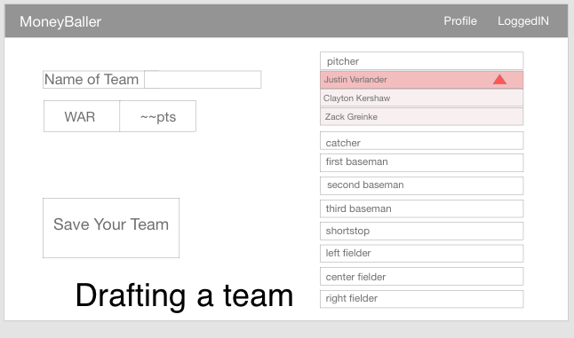
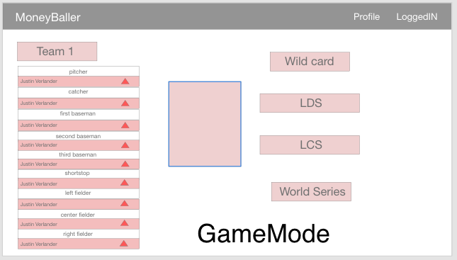
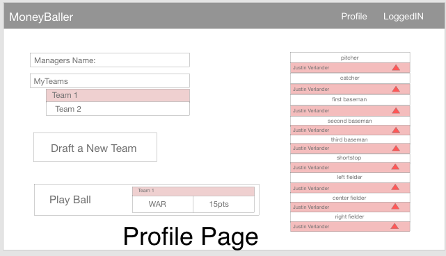
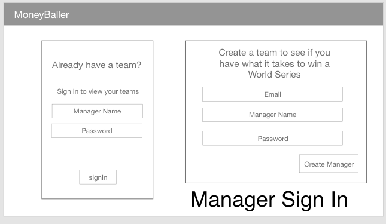

# MoneyBaller
# WireFrame






## MoneyBaller
## Project Description
```
A fantasy style game where players draft a baseball team of past and present players,
 with the goal being to build the strongest possible team based off of the WAR stat.
```
## User Story
```
As a baseball fan, I want to test my knowledge by building the best possible team,
 and compare my score with others
```
## APIs to be used
```
We will be building our own APIs from stats available online
```
## Rough Breakdown of Tasks
```
We will be working collaboratively on this project, but as of now the general tasks are:
Breon: Primarily working on js logic
Cole: Working on the design and view of the project
Jack: Working on creating the primary API containing players and stats
```